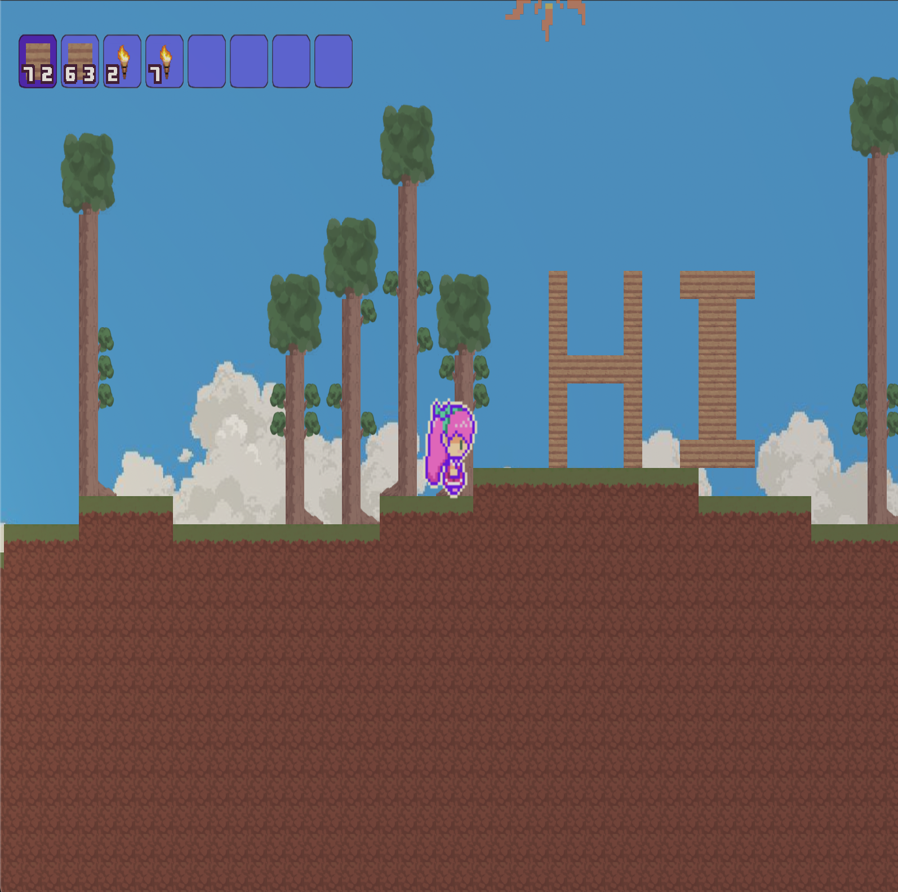
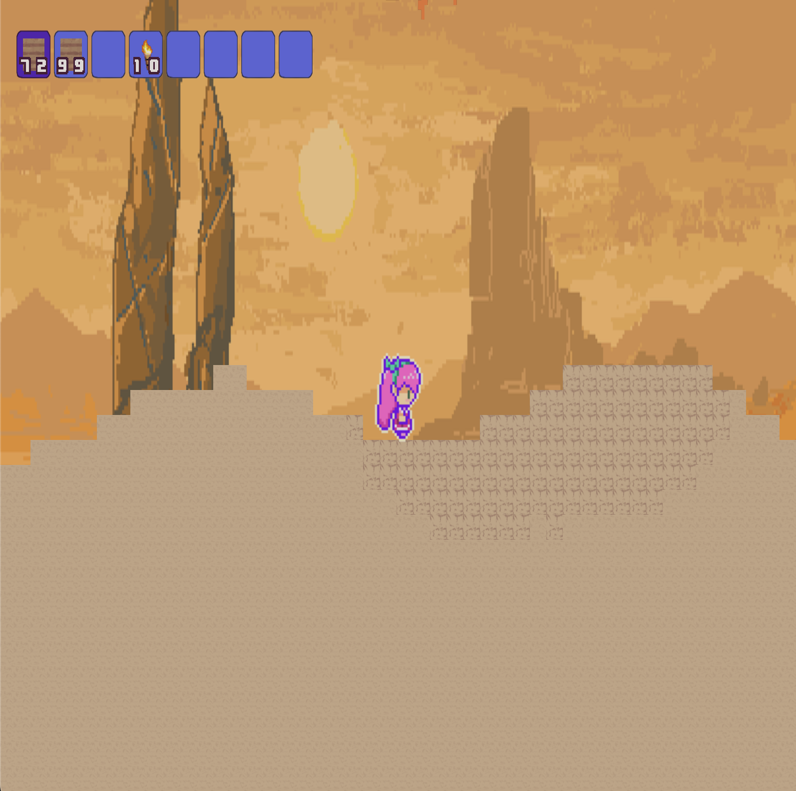
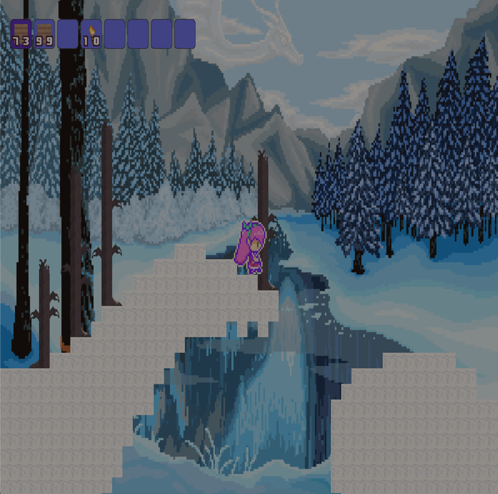
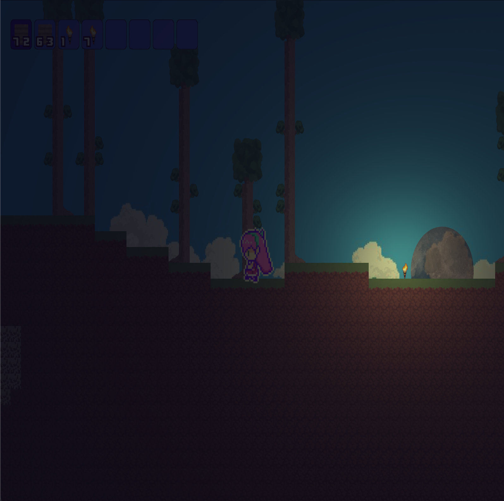

# TerrariaGL

**A terraria clone made with OpengGL and C++**

I've always loved learning about how games work at their lowest level, so this project was a perfect go for me. Everything here was created from scratch with only the help of a few libraries at my side. This was not only my first real OpenGL project, but also my first C++ project. The experience was quite challenging, but the knowledge that I gained from definetly made it all worth it!

## Screenshots

- Building and Destroying Tiles


- Biomes


- Procedural Terrain Generation


- Lighting and Day Night Cycle


## Building the Project

- Clone the repository
```shell
git clone --recursive https://github.com/neskech/TerrariaGL.git
```
- Build the project either using 'Release' or 'Debug' in substitution for <BUILD_TYPE>
```shell
cd TerrariaGL
mkdir build
cd build
cmake -DCMAKE_BUILD_TYPE=<BUILD_TYPE> ..
cmake --build .
```

- Run the executable on...

  - Mac / Linux 
  ```shell
  ./terraria
  ```
  - Windows
  ```shell
  terraria.exe
  ```
  
## Features

- Rendering
  - 
   - Tiles are only rendered if they are in view of the camera. Batch rendering is utilized
   - A seperate renderer for dynamic sprites that uses instancing
   - Sorting of sprites by their zIndex before drawing


- Gameplay
  -
    - Infinite Terrain Generation
    - Day Night Cycle
    - A different seed for world generation each time the game is booted up

- Controls
  -
     - `Left Click` Break Tile
     - `Right Click` Place Tile
     - `A and D` Move Left and Right
     - `W` Jump
     - `Ctrl + x` Freely move the Camera
     - `Ctrl + g` Disable gravity
     - `Ctrl + q` Super speed
     
     - *on mac systems, 'ctlr' is replaced with option*
  
## Libraries

- [glfw](https://github.com/glfw/glfw) - Window Management
- [GLAD](https://github.com/Dav1dde/glad) - Loading OpenGL Functions
- [entt](https://github.com/skypjack/entt) - Entity Component System
- [stb Image](https://github.com/nothings/stb) - Loading Images
- [glm](https://github.com/g-truc/glm) - Math
- [FastNoiseLite](https://github.com/Auburn/FastNoiseLite) - Terrain Generation
